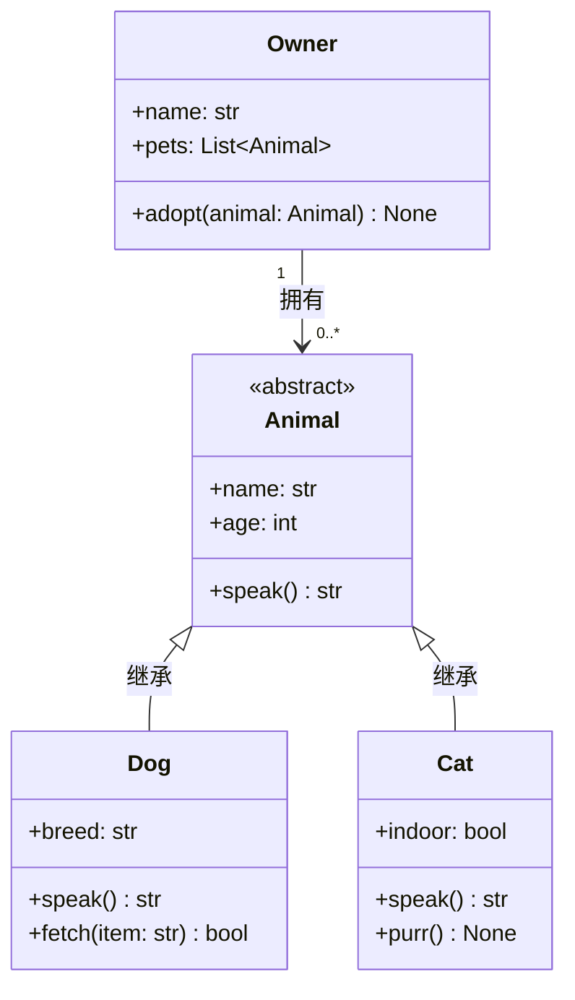
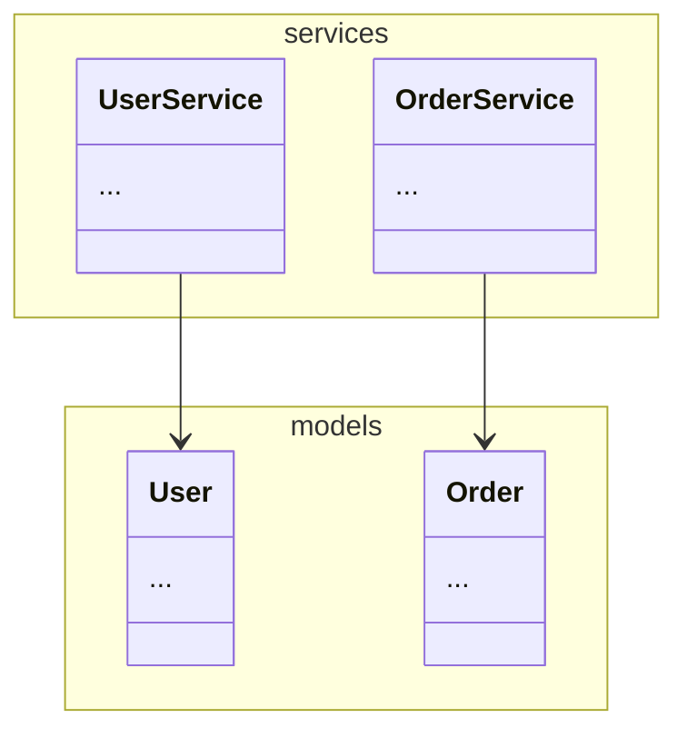
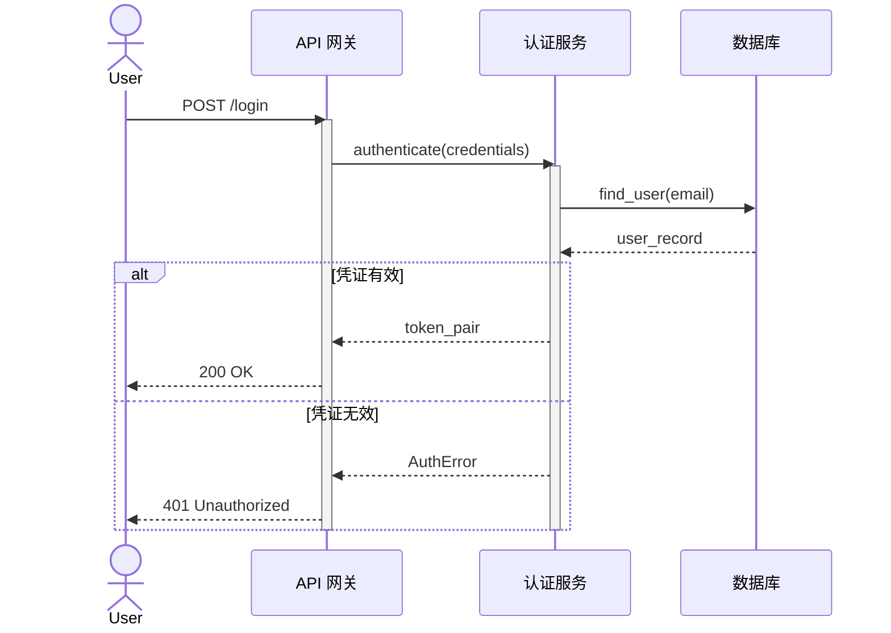
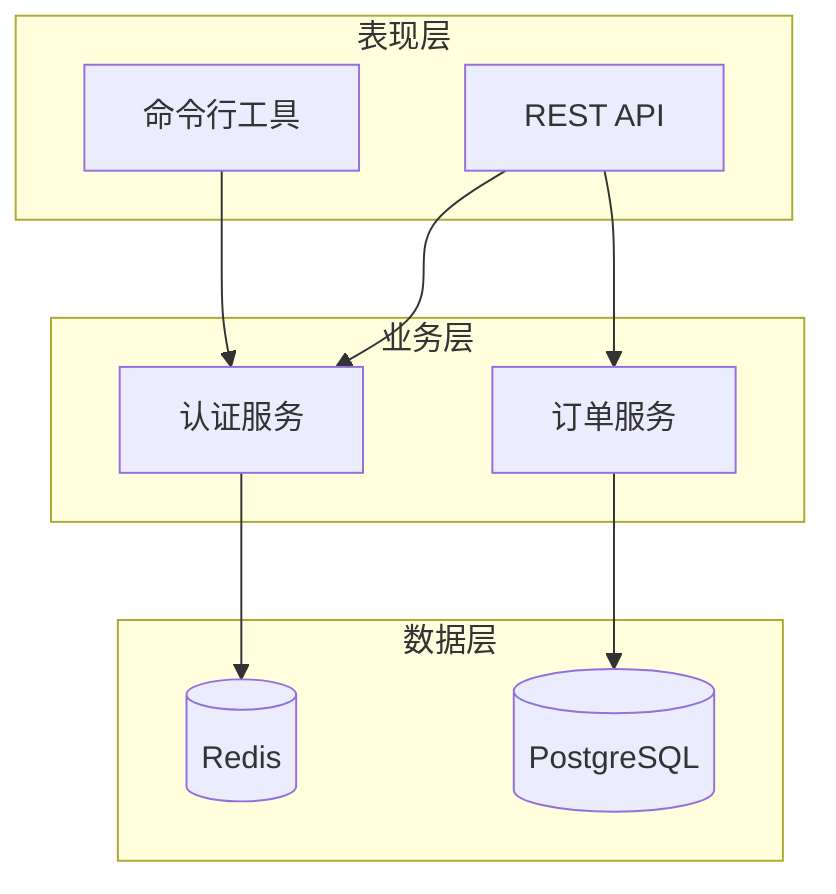
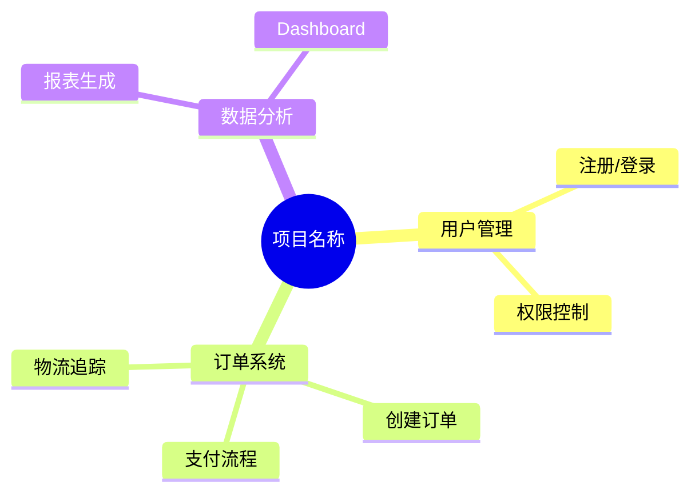
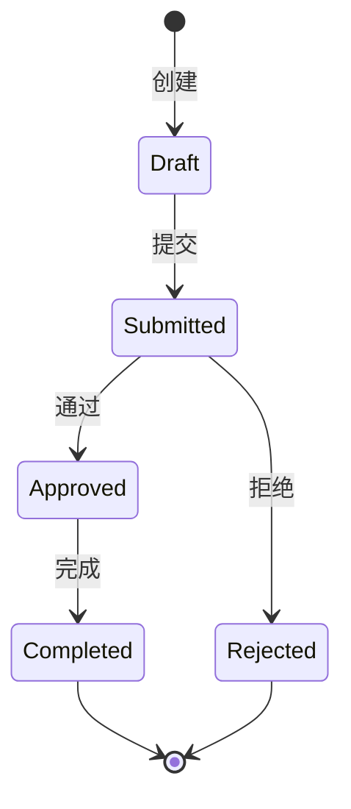

# Mermaid 图表模板

文档生成中使用的 Mermaid 语法快速参考。

## 类图



### 关系线类型

| 关系 | 语法 | 含义 |
|---|---|---|
| 继承 | `Parent <\|-- Child` | 是一种（is-a） |
| 组合 | `A *-- B` | 拥有，生命周期绑定 |
| 聚合 | `A o-- B` | 拥有，生命周期独立 |
| 关联 | `A --> B` | 使用/知道 |
| 依赖 | `A ..> B` | 依赖于 |
| 实现 | `A ..\|> Interface` | 实现接口 |

### 类型标注

```
class MyAbstract { <<abstract>> }
class MyInterface { <<interface>> }
class MyData { <<dataclass>> }
class MyEnum { <<enumeration>> }
```

### 命名空间（按模块分组）



## 时序图



### 关键语法

- `->>` 实线箭头（调用），`-->>` 虚线箭头（返回）
- `activate` / `deactivate` 生命线条
- `alt` / `else` / `end` 条件分支
- `loop` / `end` 循环
- `par` / `and` / `end` 并行
- `Note over A,B: 文本` 注释

## 组件图



### 节点形状

| 形状 | 语法 | 用途 |
|---|---|---|
| 矩形 | `[A]` | 组件 |
| 圆角 | `(A)` | 开始/结束 |
| 菱形 | `{A}` | 判断 |
| 数据库 | `[(A)]` | 数据库/存储 |

## 脑图



### 脑图规则

- `root` 使用 `(( ))` 圆形
- 使用 2 空格缩进表示层级
- 标签尽量简短（20 字以内）
- 标签中不使用特殊字符

## 状态图


